<p align="center">
  
</p>

<p align="center">
  <b>SQL veloz para cualquier base de datos.</b><br/>
  Un cliente SQL de escritorio rápido y nativo para PostgreSQL, MySQL/MariaDB, SQL Server, SQLite, Informix y ODBC,<br/>
  con un editor que conoce tu esquema, un asistente de IA con permisos y una mascota que te hace compañía.
</p>

<p align="center">
  <a href="https://github.com/e-omunoz/celer/releases/latest"></a>
  <a href="https://github.com/e-omunoz/celer/releases"></a>
  <a href="https://github.com/e-omunoz/celer/actions/workflows/ci.yml"></a>
  
</p>

<p align="center">
  <a href="https://github.com/e-omunoz/celer/releases/latest"><b>Descargar</b></a> ·
  <a href="docs/GUIA.md">Guía de uso</a> ·
  <a href="CHANGELOG.md">Cambios</a> ·
  <a href="SECURITY.md">Seguridad</a> ·
  <a href="README.md">English</a>
</p>

<p align="center">
  <a href="https://github.com/e-omunoz/celer/releases/latest/download/Celer-Setup-Windows.exe"></a>
  <a href="https://github.com/e-omunoz/celer/releases/latest/download/Celer-macOS.dmg"></a>
  <a href="https://github.com/e-omunoz/celer/releases/latest/download/Celer-Portable-Linux.AppImage"></a>
  <br/>
  <sub>
    Portables: <a href="https://github.com/e-omunoz/celer/releases/latest/download/Celer-Portable-Windows.exe">Windows</a> ·
    <a href="https://github.com/e-omunoz/celer/releases/latest/download/Celer-Portable-Linux.AppImage">Linux</a> ·
    Paquetes: <a href="https://github.com/e-omunoz/celer/releases/latest/download/Celer-Linux.deb">.deb</a> ·
    <a href="https://github.com/e-omunoz/celer/releases/latest/download/Celer-Linux.rpm">.rpm</a> ·
    <a href="https://github.com/e-omunoz/celer/releases/latest/download/SHA256SUMS.txt">SHA256SUMS.txt</a> ·
    <a href="https://github.com/e-omunoz/celer/releases/latest">notas de la versión</a>
  </sub>
</p>

Abre Celer, haz doble clic en una tabla y ya estás viendo sus filas antes de notar que ha cargado. Escribe una consulta y
el autocompletado te ofrece las columnas de las tablas que estás usando. Ctrl+clic en el nombre de una tabla la abre;
Ctrl+clic en una clave foránea te lleva a la fila a la que apunta. Carga 200.000 filas y la ventana sigue respondiendo;
si algo tarda, Gib te enseña qué está haciendo y un botón para cancelarlo.

Celer es un núcleo en Rust con una interfaz web ligera (Tauri 2). El instalador ocupa unos 13 MB, se instala solo para
tu usuario, sin permisos de administrador, y se mantiene actualizado solo.

## En acción

<p align="center">
  
</p>

## Funciones

- **Rápido por diseño.** Una sesión por pestaña, cada una en su propio hilo: una consulta lenta nunca bloquea el resto.
  Los resultados llegan por páginas desde un cursor abierto, la rejilla se dibuja en un canvas y 200.000 filas cargan
  en unos dos segundos.
- **Un editor que conoce tu esquema.** El autocompletado ofrece tablas tras `FROM`/`JOIN`, las columnas de las tablas
  de la sentencia en el resto, y `alias.` o `esquema.` acotan la lista. **Ctrl+clic** (o F4 / Ctrl+B) sobre una tabla
  la abre. La sentencia bajo el cursor se resalta; Ctrl+Enter la ejecuta. Plantillas (`sel`, `ins`, `cte`…),
  parámetros (`:nombre`, `?`) que se piden antes de ejecutar y aviso ante un `DELETE` o `UPDATE` sin `WHERE`.
- **Tablas que se exploran.** Filtros por columna (igual, contiene, entre, lista de valores…), tu propio `WHERE` y
  `ORDER BY` con ayuda en vivo (avisa cuando `"texto"` se leería como nombre de columna y lo corrige en un clic),
  orden en el servidor y recuento exacto bajo demanda. Edita celdas con editores que conocen el tipo (verdadero/falso,
  un calendario, las filas referenciadas de una clave foránea) y guárdalo todo en una transacción.
- **Claves foráneas que se siguen.** Las columnas FK se marcan en la cabecera; Ctrl+clic en un valor abre la fila
  referenciada, o abre la tabla referenciada desde la pestaña *Claves*.
- **Descubre por qué una consulta es lenta.** Planes de ejecución en árbol para todos los motores, con filas y tiempos
  reales (EXPLAIN ANALYZE) y avisos útiles. La actividad del servidor muestra sesiones y consultas en curso, con
  cancelar y matar.
- **Entiende y compara esquemas.** Diagrama entidad-relación de cualquier esquema (exportable a SVG) y comparación de
  esquemas entre dos conexiones que escribe el script para igualarlos. Los datos de dos tablas se comparan igual.
- **Resultados que se conservan.** Fija un resultado, vuelve a ejecutar y compáralos: se marcan las celdas cambiadas y
  las filas nuevas o que faltan. Filtro rápido sobre las filas cargadas.
- **Nunca se congela.** Las operaciones largas muestran a Gib con su portátil, el progreso en vivo y **Cancelar**:
  cargar todas las filas se detiene tras el bloque en curso y conserva lo recibido; las consultas se cancelan en el
  servidor.
- **Exportar e importar.** CSV, TSV, Excel, JSON, XML, `INSERT`s SQL, Markdown o HTML directos a disco; importa CSV,
  JSON u hojas de Excel / OpenDocument con mapeo de columnas en una sola transacción. Genera SELECT con joins, INSERT,
  UPDATE, UPSERT/MERGE y DDL desde el explorador.
- **IA con permisos.** Un asistente que escribe, explica, corrige y optimiza SQL con Claude usando tu esquema, nunca
  tus filas. Un **servidor MCP** (`celer.exe --mcp`) deja que Claude Desktop, Claude Code y otros clientes usen tus
  conexiones con un nivel de permiso por conexión, límites de filas y tiempo, columnas enmascaradas y registro de
  auditoría.
- **Trae tus conexiones.** Impórtalas desde **DBeaver** (con las contraseñas guardadas, si quieres) y
  **DbVisualizer**, con carpetas y marcas de producción. Arrastra conexiones entre carpetas en el explorador.
- **Pensado para jornadas largas.** Ocho temas, densidad compacta o cómoda, paleta de comandos (Shift Shift), atajos
  configurables, biblioteca de scripts que ejecuta cualquier script guardado en cualquier conexión o en varias a la vez, `${variables}` por consola, conexión o globales, script de inicio por conexión y **Gib**: piensa mientras corren las consultas,
  tiene una idea cuando acaba una larga, se va a por un café o hace malabares cuando no estás, y aparta el cursor como
  a una mosca si le molestas mientras espera.
- **Actualizaciones en la app.** Celer comprueba en GitHub si hay versiones nuevas, te enseña las novedades y las
  instala en un clic, tras verificar la descarga con las sumas SHA-256 de la versión.

<p align="center">
  <br/>
  <sub>Gib cuando no estás: un café, el portátil, malabares… y aparta el cursor si le molestas mientras espera.</sub>
</p>

<table>
  <tr>
    <td width="50%">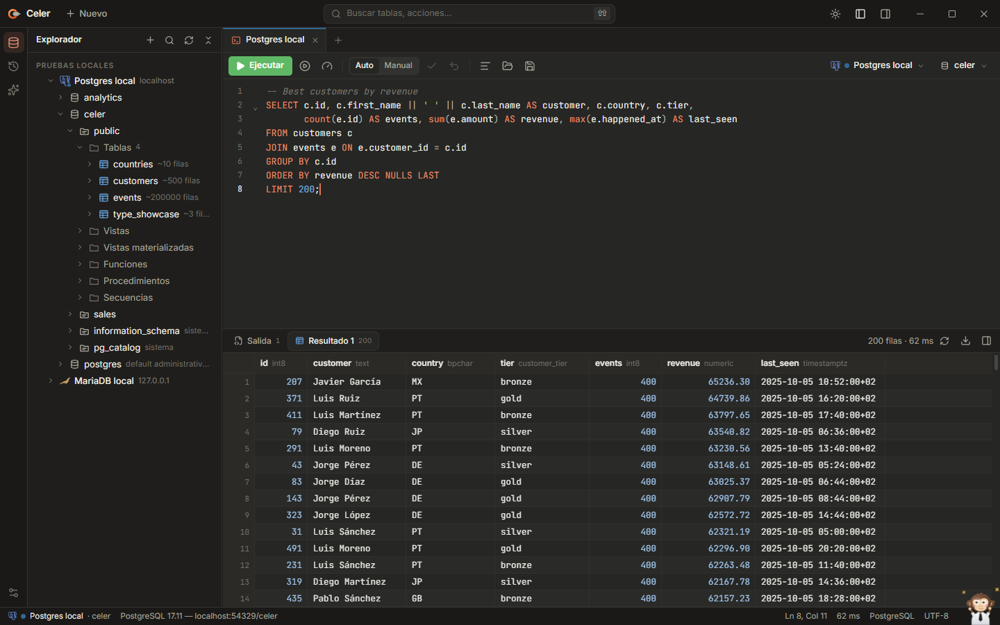<br/><sub>Consola, explorador y resultados</sub></td>
    <td width="50%">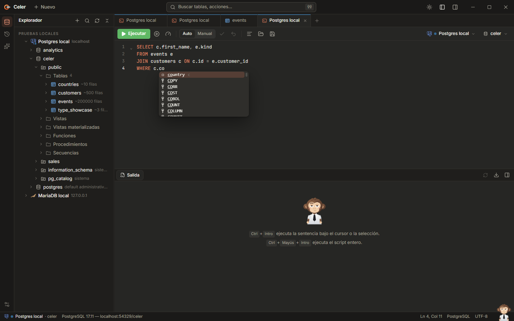<br/><sub>Autocompletado con las columnas de la sentencia</sub></td>
  </tr>
  <tr>
    <td>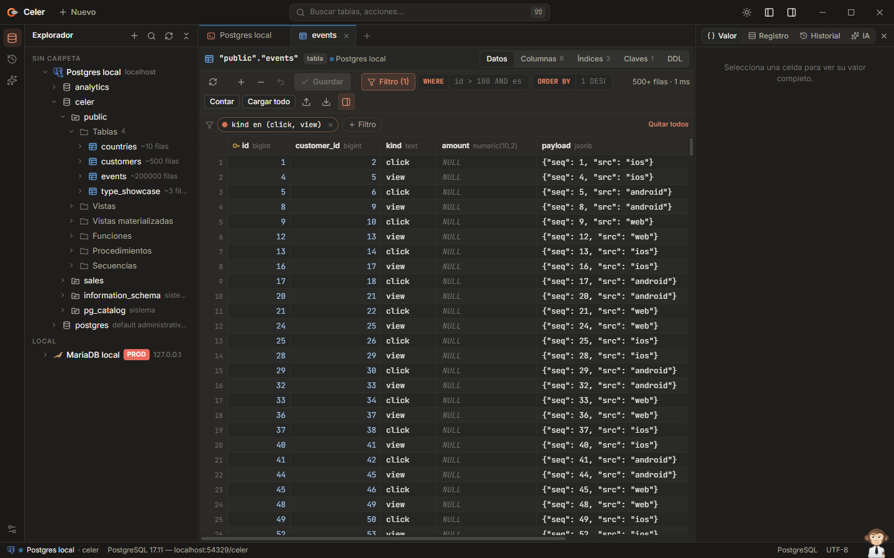<br/><sub>Visor de tabla con filtros por columna</sub></td>
    <td>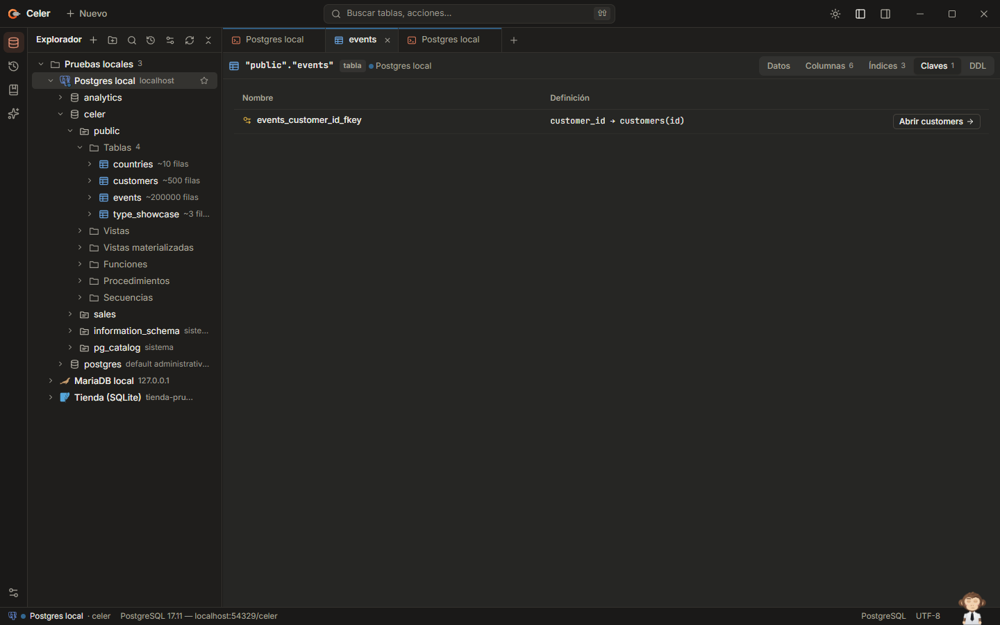<br/><sub>Claves foráneas: salta a la tabla o fila referenciada</sub></td>
  </tr>
  <tr>
    <td>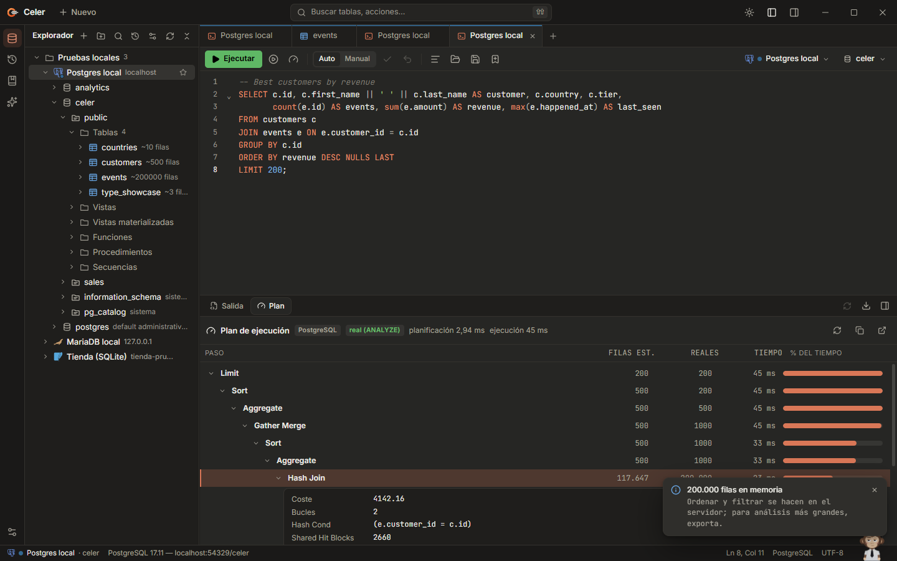<br/><sub>Plan de ejecución con filas y tiempos reales</sub></td>
    <td>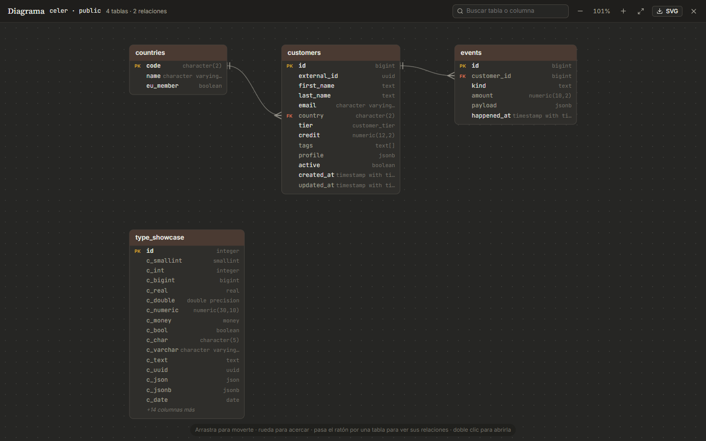<br/><sub>Diagrama entidad-relación</sub></td>
  </tr>
  <tr>
    <td>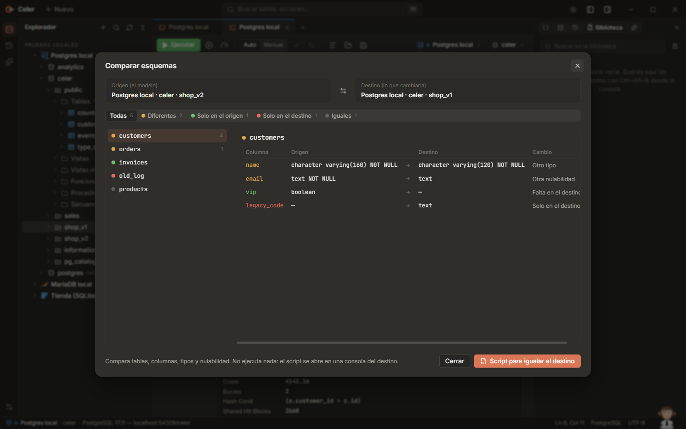<br/><sub>Comparación de esquemas y script para igualarlos</sub></td>
    <td>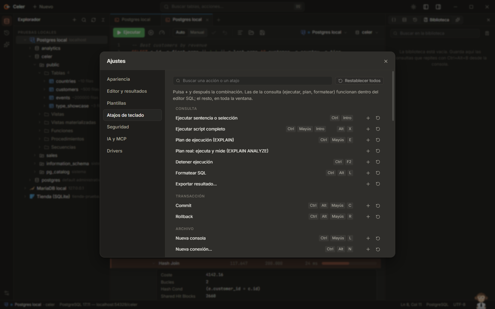<br/><sub>Atajos que puedes cambiar</sub></td>
  </tr>
  <tr>
    <td>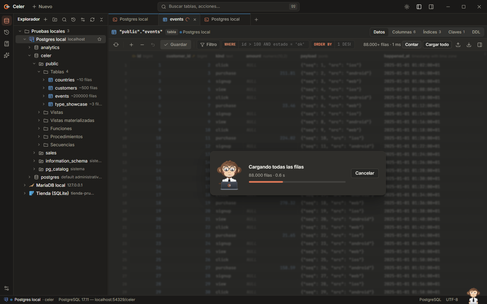<br/><sub>Cargando 200.000 filas, cancelable</sub></td>
    <td>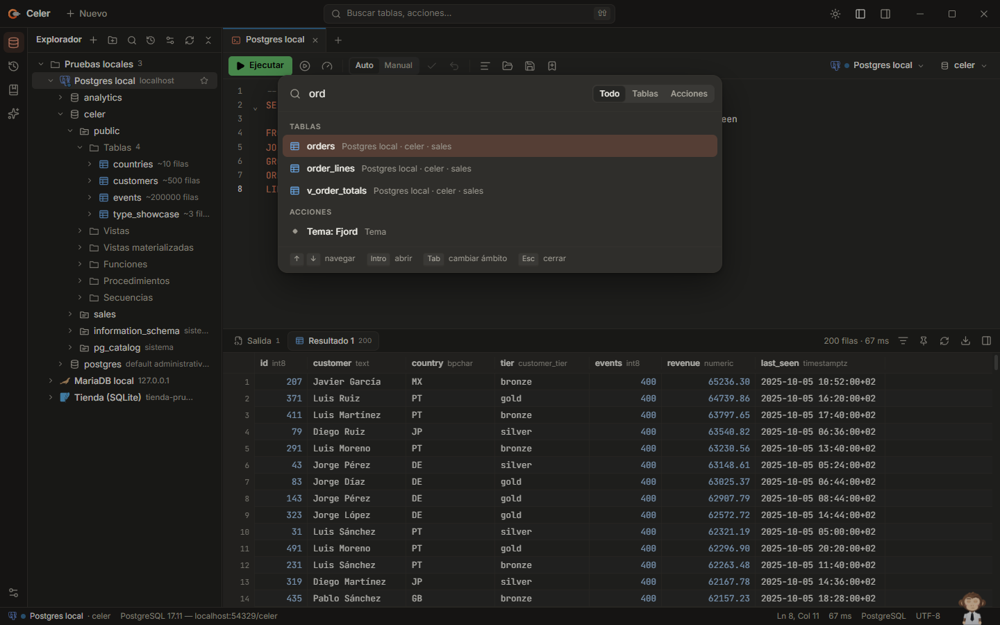<br/><sub>Paleta de comandos</sub></td>
  </tr>
  <tr>
    <td>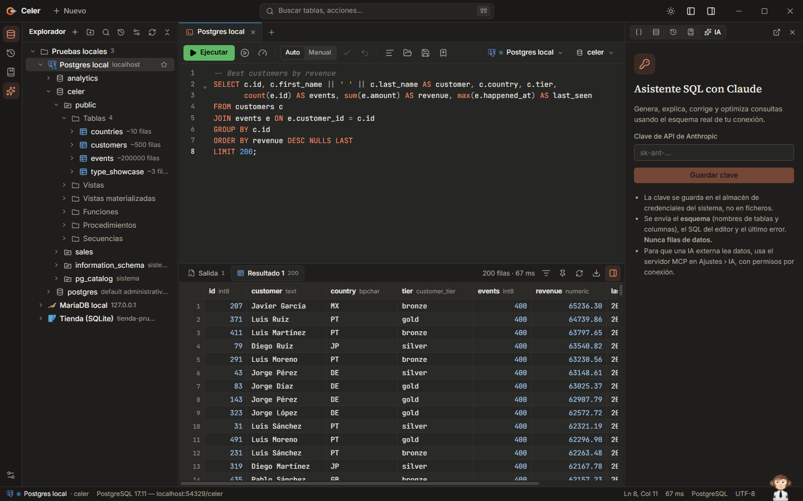<br/><sub>Asistente de IA</sub></td>
    <td>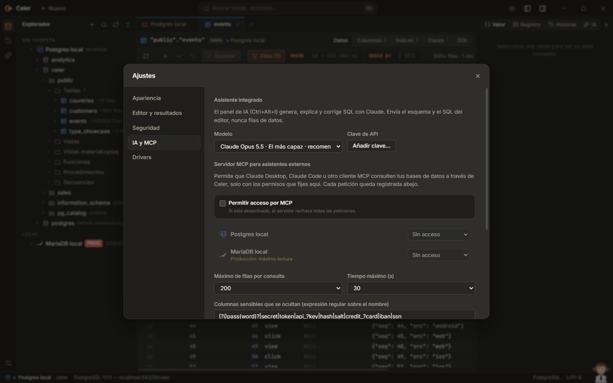<br/><sub>Servidor MCP con permisos por conexión</sub></td>
  </tr>
  <tr>
    <td>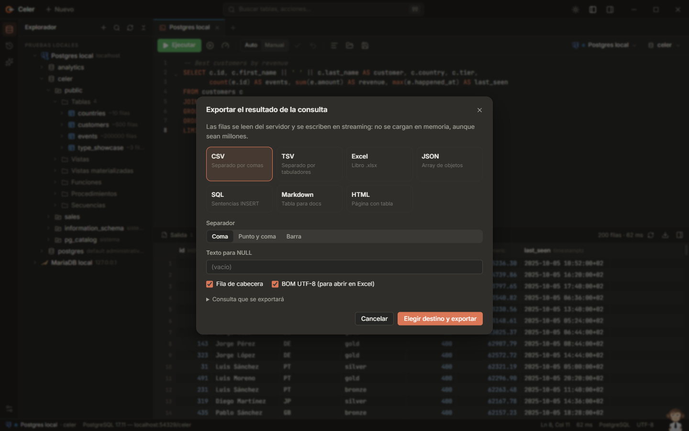<br/><sub>Exportación en streaming</sub></td>
    <td>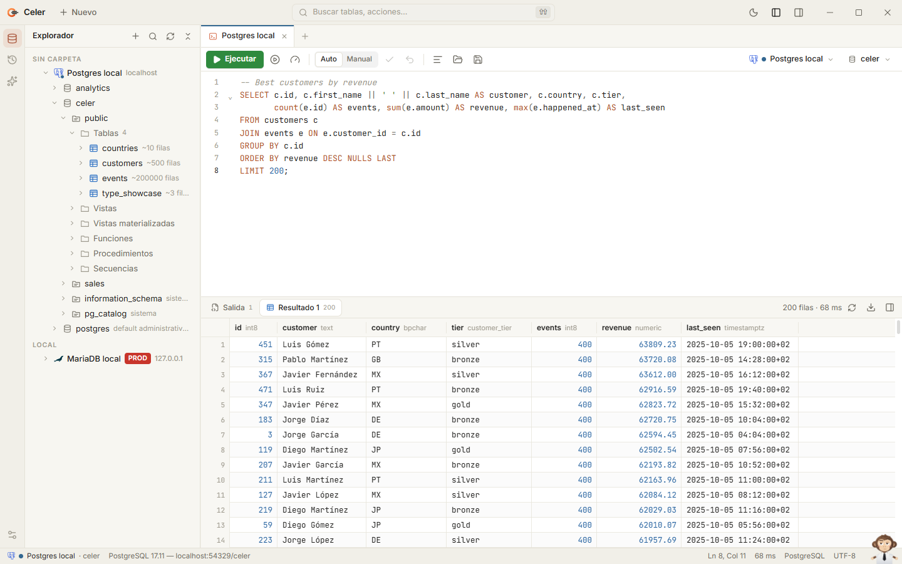<br/><sub>Tema claro</sub></td>
  </tr>
</table>

## Instalación

Los botones de arriba descargan siempre la última versión. Todas las versiones usan los mismos nombres de fichero:

| Sistema | Fichero |
|---|---|
| Windows | `Celer-Setup-Windows.exe` (instalador) · `Celer-Portable-Windows.exe` (sin instalar) |
| macOS | `Celer-macOS.dmg` (Apple silicon e Intel) |
| Linux | `Celer-Portable-Linux.AppImage` · `Celer-Linux.deb` · `Celer-Linux.rpm` |
| Todos | `SHA256SUMS.txt`, con el SHA-256 de cada fichero |

### Windows

1. Descarga **`Celer-Setup-Windows.exe`** (el botón de Windows de arriba, o desde la
   [última versión](https://github.com/e-omunoz/celer/releases/latest)) y ejecútalo.
2. Elige carpeta y accesos directos (o pulsa *Instalar* sin más).
3. Abre Celer: una guía corta te enseña la interfaz y puede crear una base de datos de ejemplo para trastear.

Celer se instala en `%LOCALAPPDATA%\Programs\Celer`, añade una entrada al menú Inicio y aparece en
*Configuración › Aplicaciones* para desinstalarlo. Funciona en Windows 10 y 11 (WebView2, incluido en Windows). Cuando
hay una versión nueva, Celer te avisa; no se descarga nada hasta que pulsas *Actualizar*. También puedes ejecutar un
instalador más nuevo encima.

Como los ejecutables aún no están firmados, SmartScreen puede avisar la primera vez (*Más información › Ejecutar de
todas formas*). Cada versión se puede verificar con su `SHA256SUMS.txt`, como se explica en [SECURITY.md](SECURITY.md).

`Celer-Portable-Windows.exe` funciona desde cualquier carpeta, sin instalar. No se actualiza sola: cuando hay una
versión nueva, Celer abre su página.

### macOS y Linux

`Celer-macOS.dmg` es universal (Apple silicon e Intel). Para Linux están `Celer-Portable-Linux.AppImage`,
`Celer-Linux.deb` y `Celer-Linux.rpm`. No están firmados: en macOS ábrelo la primera vez con clic derecho › *Abrir*;
en Linux haz ejecutable el AppImage (`chmod +x`). La actualización desde la app es para Windows; en macOS y Linux
Celer abre la página de la versión para que descargues el paquete nuevo.

### Despliegue en empresas

Celer Setup se instala en silencio, para el usuario que lo ejecuta y sin permisos de administrador, así que la
herramienta de despliegue (Intune, Configuration Manager…) debe lanzarlo en el contexto del usuario. El enlace
`https://github.com/e-omunoz/celer/releases/latest/download/Celer-Setup-Windows.exe` sirve siempre la última versión.

```bat
Celer-Setup-Windows.exe --silent [--dir "C:\Tools\Celer"] [--desktop | --no-desktop] [--no-start-menu | --start-menu] [--associate-sql | --no-associate-sql] [--launch]
"%LOCALAPPDATA%\Programs\Celer\uninstall.exe" --uninstall --silent [--purge-data]
```

| | |
|---|---|
| Actualizar | Ejecuta el `Celer-Setup-Windows.exe --silent` nuevo; se conservan ajustes y conexiones, y también la carpeta, los accesos directos y la asociación de `.sql` de la instalación actual salvo que un parámetro los cambie (`--no-desktop`, `--no-associate-sql`…) |
| Código de salida | 0 si todo va bien; los errores se escriben en `%TEMP%\celer-setup.log` |
| Desinstalar | Quita todo menos el propio `uninstall.exe` (Windows no deja que un programa en ejecución se borre a sí mismo); lo retira la siguiente instalación, o bórralo a mano |

Hasta la 2.0.1 también había un paquete MSI. Ya no se publica: las copias instaladas con él siguen funcionando; para
pasar a Celer Setup, desinstala la copia MSI (tus datos se conservan) e instala `Celer-Setup-Windows.exe`.

## Bases de datos

| Motor | Driver | Estado |
|---|---|---|
| PostgreSQL | nativo: cursores en servidor, cancelación, DDL completo | ✅ |
| MySQL / MariaDB | nativo: streaming, `KILL QUERY`, `DELIMITER` | ✅ |
| SQL Server | nativo (TDS), autenticación de Windows | ✅ |
| SQLite | embebido | ✅ |
| Informix | JDBC (puente de Celer; Java y driver encontrados o descargados bajo demanda), Client SDK o IBM CLI | ✅ |
| Cualquier origen ODBC | gestor de drivers ODBC | ✅ |
| Oracle, Db2, DuckDB, ClickHouse, Snowflake… | — | previsto |

## Atajos de teclado

| Atajo | Acción |
|---|---|
| `Ctrl+Enter` / `Ctrl+Shift+Enter` | Ejecutar la sentencia / el script entero |
| `Ctrl+clic` · `F4` · `Ctrl+B` | Abrir la tabla bajo el cursor (en el SQL) |
| `Ctrl+clic` en un valor FK | Abrir la fila referenciada |
| `Shift` `Shift` · `Ctrl+K` | Buscar tablas, pestañas y acciones |
| `Ctrl+N` | Ir a tabla |
| `Ctrl+Shift+A` | Acciones |
| `Ctrl+Shift+L` | Nueva consola |
| `Ctrl+Shift+N` | Ventana nueva (arrastra una pestaña fuera de la barra para llevarla a otra). Con el foco en el explorador crea una carpeta; en la rejilla de una tabla pone NULL |
| `Ctrl+Alt+N` | Nueva conexión |
| `Ctrl+Alt+L` | Formatear SQL |
| `Ctrl+Shift+E` | Plan de ejecución |
| `Ctrl+F2` | Detener |
| `Ctrl+Alt+I` | Asistente de IA |
| `Ctrl+Alt+E` | Historial |
| `Ctrl+Alt+B` | Guardar la consola en la biblioteca de scripts |
| `Alt+8` | Biblioteca de scripts |
| `Alt+9` | Variables (valores de `${nombre}` por consola, conexión o globales) |
| `Ctrl+Alt+S` | Ajustes |
| `Ctrl+Alt+Shift+C` / `Ctrl+Alt+Shift+R` | Commit / rollback |

Todos los atajos se pueden cambiar en *Ajustes › Atajos de teclado*. En macOS, `Ctrl` es `⌘`.

## Privacidad y seguridad

- Sin cuentas ni telemetría. Tus datos no salen del equipo salvo que tú lo pidas.
- Las contraseñas y la clave de IA se guardan en el almacén de credenciales del sistema, nunca en ficheros.
- Más allá de tus bases de datos, Celer solo se conecta para: comprobar actualizaciones en la API de GitHub Releases
  (no envía nada sobre ti y se puede desactivar), descargar el driver de IBM cuando lo pides y el asistente de IA si
  configuras tu propia clave (recibe el esquema, nunca filas).
- El servidor MCP funciona en local por stdio, está desactivado por defecto y solo ve lo que permite cada conexión.
- Las conexiones de solo lectura rechazan escrituras, aunque vayan escondidas en un lote; las de producción piden
  confirmación antes de sentencias arriesgadas.

Detalles y cómo informar de una vulnerabilidad: [SECURITY.md](SECURITY.md).

## Rendimiento

Medido en un portátil contra la base de datos PostgreSQL de pruebas:

| | |
|---|---|
| Primera página de 500 filas | unos milisegundos tras la respuesta del servidor |
| Cargar 200.000 filas en la rejilla | unos 2 s, la ventana sigue respondiendo |
| Seleccionar todo / copiar 200.000 filas | ~40 ms / ~250 ms |
| Exportar 200.000 filas a CSV | ~1 s, en streaming a disco |

## Compilar desde el código

Requisitos: [Rust](https://rustup.rs) (estable), [Node.js](https://nodejs.org) 20+ y, en Windows, Visual Studio Build
Tools con la carga de trabajo de C++.

```bash
git clone https://github.com/e-omunoz/celer
cd celer
npm install
npm run tauri dev
```

`npm run dev` abre la misma interfaz en el navegador contra una demo SQLite en memoria. Las versiones las compila y
publica GitHub Actions al empujar una etiqueta `vX.Y.Z` (ver [CONTRIBUTING.md](CONTRIBUTING.md#releases)).

| Carpeta | Contenido |
|---|---|
| `src/` | Interfaz (SolidJS + TypeScript): espacio de trabajo, rejilla, editor, explorador, diálogos, IA, guía |
| `src/gib/` | Gib, la pantalla de arranque y el acompañante de la barra de estado |
| `src-tauri/src/` | Núcleo en Rust: drivers, sesiones, exportación, servidor MCP, actualizaciones, migración |
| `installer/` | Celer Setup: instalador y desinstalador propios |
| `docs/` | Arquitectura, diseño, drivers, hoja de ruta, IA/MCP; `docs/media` se regenera con `dev/readme-media.mjs` |
| `dev/` | Bases de datos de prueba, comprobaciones end-to-end, captura de medios y scripts de publicación |

## Contribuir

Los fallos e ideas son bienvenidos en [Issues](https://github.com/e-omunoz/celer/issues). Las convenciones,
comprobaciones y cómo se publica están en [CONTRIBUTING.md](CONTRIBUTING.md). Los problemas de seguridad, por privado
como indica [SECURITY.md](SECURITY.md).

<p align="center">
  <br/>
  <sub>Hecho con cariño · Gib te saluda 👋</sub>
</p>
