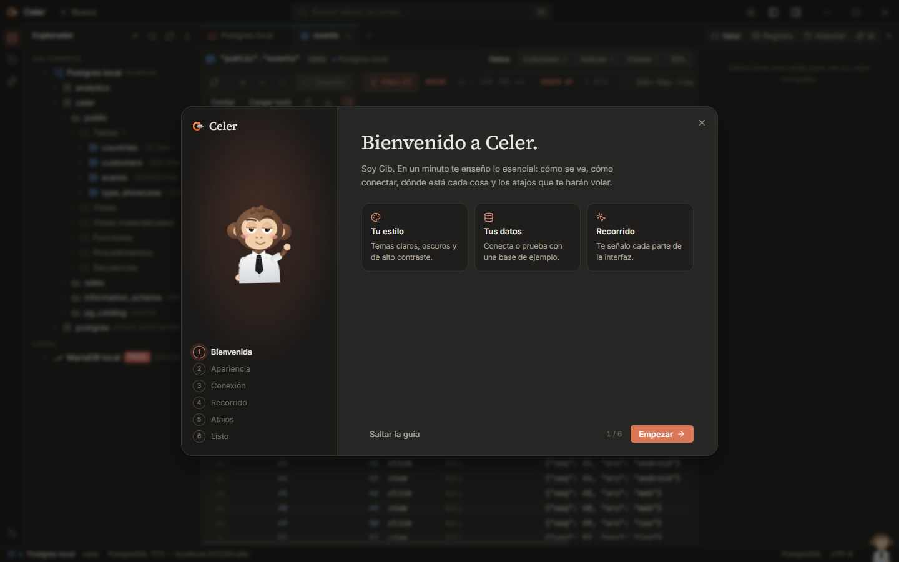

<p align="center">
  
</p>

<p align="center">
  <a href="https://github.com/e-omunoz/celer/releases/latest"></a>
  <a href="https://github.com/e-omunoz/celer/actions/workflows/ci.yml"></a>
  <a href="https://github.com/e-omunoz/celer/releases"></a>
  
  
</p>

<p align="center">
  <b>A fast, native desktop SQL client — light on memory, heavy on detail.</b><br/>
  <a href="#install">Download</a> ·
  <a href="#features">Features</a> ·
  <a href="#databases">Databases</a> ·
  <a href="#keyboard-shortcuts">Shortcuts</a> ·
  <a href="#build-from-source">Build</a> ·
  <a href="CHANGELOG.md">Changelog</a>
</p>

<p align="center">
  
</p>

## Why Celer

- **Instant.** A Rust core with one thread per session: a slow query never freezes the window, and 200,000 rows load
  into the grid in about a second.
- **Native drivers.** PostgreSQL, MySQL / MariaDB, SQL Server and SQLite need nothing installed. Informix and any ODBC
  source load the vendor library only when you use them.
- **Made for long sessions.** A warm, quiet interface with eight themes, a canvas data grid, a command palette and the
  keyboard shortcuts you already know.
- **AI with permissions.** An assistant that sees your schema, never your rows, and an MCP server so Claude and
  other clients can read your databases with per-connection limits and an audit log.
- **Yours.** Passwords and API keys live in the operating system's credential store. No account, no telemetry.

> The interface is in Spanish. English is on the [roadmap](docs/ROADMAP.md).

## Install

Everything is on the [latest release](https://github.com/e-omunoz/celer/releases/latest).

| System | Download | Notes |
|---|---|---|
| **Windows** | `Celer-Setup-x.y.z.exe` | Recommended. Installs for your user only (no administrator rights) and updates itself in one click. |
| Windows (IT) | `Celer-x.y.z-x64.msi` | Per-machine package for managed deployments (GPO, Intune). |
| Windows | `Celer-x.y.z-portable.exe` · `…-nsis-setup.exe` | Runs without installing · classic installer. |
| **macOS** 11+ | `Celer-x.y.z-macos-universal.dmg` | Apple Silicon and Intel. The app is not notarised yet: the first time, right-click → *Open*. |
| **Linux** | `.AppImage` · `.deb` · `.rpm` | x86_64. Credentials are stored in the Secret Service (GNOME Keyring, KWallet). |

Open Celer and a short guide shows you around; it can create a sample database for you to play with. Every release
also carries `SHA256SUMS` files to verify the downloads, and Celer checks for new versions on start-up.

## Features

### SQL editor and results


- CodeMirror editor with schema-aware completion, formatting (`Ctrl+Alt+L`) and the current statement highlighted.
- `Ctrl+Enter` runs the statement under the caret, `Ctrl+Shift+Enter` the whole script, and `Ctrl+Shift+E` shows the plan.
- Results are paged from an open cursor. Load the next page, load everything, or cancel at any time.
- Auto or manual transactions, with commit and rollback always in sight. Production connections ask before a write,
  and read-only connections refuse one, even when it is hidden in a batch.

### Table viewer with real filters


- Filter chips per column: equals, contains, between, null checks and value checklists. You can also write your own
  `WHERE` and `ORDER BY`.
- Sorting runs on the server, and there is an exact row count on demand.
- Edit cells, add and delete rows, then save them all in one transaction or revert.
- Columns, indexes, keys and DDL for every table.

### Command palette


Press `Shift` twice or `Ctrl+K` to reach every table, tab and action. `Ctrl+N` jumps straight to a table.

### Export and import


- Export streams CSV, TSV, Excel, JSON, SQL `INSERT`s (batched, in each dialect), Markdown and HTML. You get progress,
  can cancel, and can open the folder when it finishes.
- Import CSV/TSV with column mapping, in a single transaction.

### AI assistant and MCP server

<table>
  <tr>
    <td width="50%"></td>
    <td width="50%"></td>
  </tr>
</table>

- **Assistant** (`Ctrl+Alt+I`): ask in plain language, or explain, fix and optimise the current query with Claude.
  It receives the schema, never row data, and you insert, replace or run its SQL with one click.
- **MCP server** (`celer.exe --mcp`): lets Claude Desktop, Claude Code and other MCP clients use your connections.
  - Each connection has a level: none, schema, read or write.
  - Limits on rows and time, and masking of sensitive columns.
  - An audit log of every request.

  See [docs/AI_MCP.md](docs/AI_MCP.md).

### Themes, guide and Gib

<table>
  <tr>
    <td width="50%"></td>
    <td width="50%"></td>
  </tr>
</table>

- Themes: Celer dark and light, Darcula, Fjord, Sand, two high-contrast themes, or follow the system. Choose compact or
  comfortable density.
- A start-up guide: pick a theme, connect or create a sample database, then follow a spotlight tour of the interface.
- **Gib** lives in the status bar.
  - He thinks while a query runs, has an idea when a long one finishes and shrugs at errors.
  - He offers tips based on how you work.
  - Click him for a tip, or turn him off in Settings.

## Databases

| Engine | Driver | Status |
|---|---|---|
| PostgreSQL | native (server-side cursors, cancel, full DDL) | ✅ |
| MySQL / MariaDB | native (streaming, `KILL QUERY`, `DELIMITER`) | ✅ |
| SQL Server | native (TDS) | ✅ |
| SQLite | embedded | ✅ |
| Informix | IBM CLI / Client SDK, loaded on demand | ✅ |
| Any ODBC source | ODBC driver manager | ✅ |
| Oracle, Db2, libSQL / Turso | — | 🟡 planned |
| DuckDB, ClickHouse, Snowflake, BigQuery, Redshift, Trino… | — | 🟡 planned |

The full matrix, connection strategies and licensing are in [docs/DRIVERS.md](docs/DRIVERS.md).

## Performance

Measured on a laptop against the seeded PostgreSQL test database:

| Workload | Result |
|---|---|
| First page of 500 rows on screen | a few milliseconds after the server answers |
| Load all 200,000 rows into the grid | 1.3 s |
| Export 200,000 rows to CSV | streaming, memory stays flat |
| Grid scrolling, 50 columns | 60 fps (canvas) |

Targets and method: [docs/ROADMAP.md](docs/ROADMAP.md#performance-targets).

## Keyboard shortcuts

| Action | Keys |
|---|---|
| Run statement / script | `Ctrl+Enter` / `Ctrl+Shift+Enter` |
| Execution plan | `Ctrl+Shift+E` |
| Stop | `Ctrl+F2` |
| Search everything | `Shift` `Shift` or `Ctrl+K` |
| Go to table | `Ctrl+N` |
| Actions | `Ctrl+Shift+A` |
| New console | `Ctrl+Shift+L` |
| New connection | `Ctrl+Alt+N` |
| Format SQL | `Ctrl+Alt+L` |
| AI assistant | `Ctrl+Alt+I` |
| History | `Ctrl+Alt+E` |
| Settings | `Ctrl+Alt+S` |
| Commit / rollback | `Ctrl+Alt+Shift+C` / `Ctrl+Alt+Shift+R` |

## Build from source

Requirements: [Rust](https://rustup.rs) (stable), [Node.js](https://nodejs.org) 20+, and on Windows the Visual Studio
Build Tools with the C++ workload.

```bash
npm install
npm run tauri dev
```

The same interface runs in a browser with `npm run dev`, against an in-memory SQLite demo.

```bash
npm run tauri build
```

`npm run tauri build` builds the app; `dev/release.ps1` builds all the release files (see [CONTRIBUTING.md](CONTRIBUTING.md#releases)).

<details>
<summary>Project layout</summary>

```
src/                    Interface (SolidJS + TypeScript)
  components/           Workspace, grid, explorer, dialogs, AI panel, guide
  gib/                  Gib, the start-up splash and the status-bar companion
src-tauri/src/          Rust core
  session.rs            Driver trait and one session per thread
  postgres.rs mysql.rs  Native PostgreSQL and MySQL/MariaDB drivers
  mssql.rs sqlite.rs    SQL Server and SQLite drivers
  odbc.rs odbc_driver.rs ODBC layer with dynamic loading (Informix, generic ODBC)
  export.rs             Streaming export
  mcp.rs                MCP server, permissions and audit log
  store.rs              Connections, settings and history
installer/              Celer Setup: custom installer and uninstaller (Tauri)
docs/                   Architecture, design, drivers, roadmap, AI/MCP, brand
dev/                    Test databases, end-to-end tests, media capture, release scripts
```
</details>

## Documentation

- [Architecture](docs/ARCHITECTURE.md): stack, sessions, paging, the `Driver` trait and persistence.
- [Design](docs/DESIGN.md): the product and interface guide.
- [Drivers](docs/DRIVERS.md): support matrix, connection strategies and test containers.
- [AI and MCP](docs/AI_MCP.md): assistant, MCP server, permissions and privacy.
- [Roadmap](docs/ROADMAP.md) and [status](STATUS.md).

## Contributing

Issues and pull requests are welcome. Read [CONTRIBUTING.md](CONTRIBUTING.md) for the workflow, conventions and how
to run the tests. To report a vulnerability, follow [SECURITY.md](SECURITY.md) instead of opening a public issue.

<p align="center">
  <br/>
  <sub>Made with care · Gib says hi 👋</sub>
</p>
